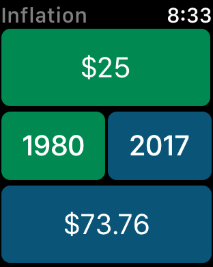
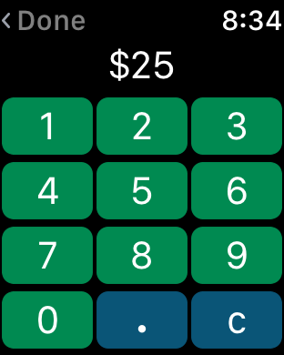
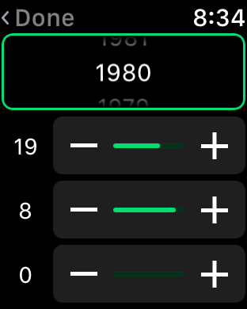
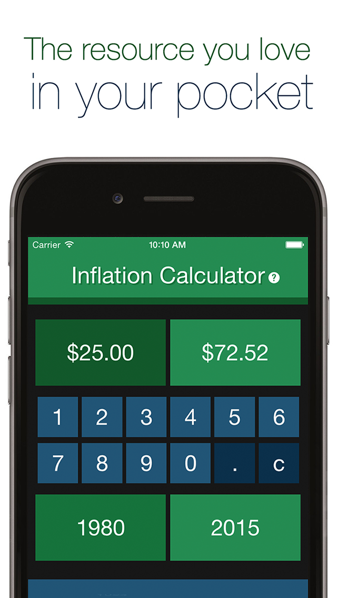

 ## Inflation Calculator

 An Inflation Calculator for iOS and watchOS. Supports 18 international currencies, including the US Dollar, the Euro, Yen, and more.
 
 Currently on version 3.x, Inflation Calculator has been on the App Store since 2014. It's been used over 700,000 times, and has a **4.9**/5 star rating on the App Store.
 
  ### iOS
 
 

     

 

 ### watchOS
 

        

 
  

 ### 1.0 - September 2014
 
 Inflation Calculator was the first app I ever published on the App Store. It's come a long way since then.
 

 

    
 

